# Dokumentasi Activity Diagram - Sistem FINDIT (UBSI Lost & Found)

Dokumentasi ini berisi rancangan **Activity Diagram UML 2.0 Enterprise-Grade** dari awal hingga akhir untuk website **FINDIT (UBSI Lost & Found)**.

Berkas diagram dapat dibuka dan diedit langsung menggunakan **Draw.io (diagrams.net)**:
- 📁 **File Draw.io:** [`docs/activity_diagram_findit.drawio`](./activity_diagram_findit.drawio)
- 📁 **File XML:** [`docs/activity_diagram_findit.xml`](./activity_diagram_findit.xml)

---

## 1. Keunggulan & Peningkatan Kualitas Desain Diagram

Diagram ini telah dirancang ulang secara presisi dengan standar diagram korporat/akademik (Skripsi & Tugas Akhir):
1. **Symmetrical Grid Alignment:** Setiap node diposisikan tepat pada sumbu tengah vertikal masing-masing swimlane (Lane Mahasiswa: x=220, Lane Sistem: x=640, Lane Petugas: x=1060).
2. **Enterprise Color Coding & Solid Header:**
   - **Mahasiswa (Pelapor & Pemilik):** *Royal Blue* (`#1E3A8A`) dengan aksen lembut.
   - **Sistem FINDIT (Platform, Matching & Security):** *Deep Violet* (`#5B21B6`).
   - **Petugas Layanan Kampus (Satpam & Staf Inventaris):** *Emerald Forest* (`#065F46`).
3. **UML 2.0 Standard Notation:**
   - *Action States* dengan sudut tumpul halus (`arcSize=24`) dan subtle drop shadow.
   - *Decision Diamonds* berpenanda eksplisit `[Sah / Sesuai]` dan `[Tidak Sah]`.
   - *Object Nodes* berbentuk dokumen untuk artefak kunci: `Tiket QR Code Pengambilan` dan `Dokumen BAST Resmi Kampus`.
   - *Line Jump Bridges* (`jumpStyle=arc`): Garis konektor yang bersilangan otomatis melengkung rapi seperti jembatan (tidak saling memotong kaku).
4. **Struktur Multi-Tab / Multi-Page:**
   - **Tab 1: `1. Activity Diagram End-to-End`** (Alur komprehensif dari awal hingga akhir).
   - **Tab 2: `2. Alur Pelaporan & Pengamanan`** (Detail pelaporan temuan/hilang + algoritma Smart Matching).
   - **Tab 3: `3. Alur Klaim & Serah Terima BAST`** (Detail pengajuan klaim, validasi QR AJAX realtime, dan BAST).

---

## 2. Panduan Membuka & Mengedit di Draw.io

### Opsi 1: Melalui Browser (Online - app.diagrams.net)
1. Buka browser dan buka [**https://app.diagrams.net**](https://app.diagrams.net).
2. Pilih **"Open Existing Diagram"** (atau menu **File** -> **Open from** -> **Device...**).
3. Pilih berkas [`docs/activity_diagram_findit.drawio`](./activity_diagram_findit.drawio).
4. Di bagian bawah layar, terdapat 3 tab halaman diagram yang siap dipresentasikan atau diekspor.
5. Untuk mengekspor ke dokumen Word / Skripsi: pilih menu **File** -> **Export as** -> **PNG** (centang *Transparent Background* dan *High DPI*) atau **PDF**.

### Opsi 2: Menggunakan Draw.io Desktop
1. Buka aplikasi **Draw.io Desktop** di komputer Anda.
2. Drag & drop berkas `docs/activity_diagram_findit.drawio` langsung ke aplikasi.

### Opsi 3: Di dalam VS Code
1. Install ekstensi **Draw.io Integration** di VS Code.
2. Klik file `activity_diagram_findit.drawio` di folder `docs/`, canvas visual akan langsung terbuka di tab editor.

---

## 3. Visualisasi Alur Sistem (Mermaid Architecture)

```mermaid
flowchart TD
    %% Styling Class
    classDef mhs fill:#eff6ff,stroke:#1e40af,stroke-width:2px,color:#1e3a8a;
    classDef sys fill:#f5f3ff,stroke:#6d28d9,stroke-width:2px,color:#4c1d95;
    classDef stf fill:#ecfdf5,stroke:#047857,stroke-width:2px,color:#064e3b;
    classDef dec fill:#fef3c7,stroke:#d97706,stroke-width:2px,color:#92400e;
    classDef doc fill:#fffbeb,stroke:#f59e0b,stroke-width:2px,stroke-dasharray: 5 5,color:#78350f;
    classDef term fill:#0f172a,stroke:#ef4444,stroke-width:3px,color:#ffffff;

    Start((Mulai)):::term --> MHS_Login["Mahasiswa / Staf:<br>Akses Web & Login / Registrasi"]:::mhs
    MHS_Login --> SYS_Auth["Sistem FINDIT:<br>Validasi Kredensial & Role Akun"]:::sys
    SYS_Auth --> Dec_Auth{"Kredensial<br>Valid?"}:::dec

    Dec_Auth -- [Tidak Valid] --> MHS_Login
    Dec_Auth -- [Valid] --> SYS_Dash["Sistem FINDIT:<br>Buka Dashboard Sesuai Role"]:::sys

    SYS_Dash --> Fork_Main{Pilihan Layanan}:::dec

    %% JALUR LAPOR TEMUAN
    Fork_Main -- Menemukan Barang --> MHS_LaporT["Mahasiswa:<br>Form Lapor Temuan<br>+ Upload Min. 2 Foto"]:::mhs
    MHS_LaporT --> SYS_SimpanT["Sistem FINDIT:<br>Generate Kode FD-YYYY-XXXXX<br>Status: MENUNGGU VERIFIKASI"]:::sys
    SYS_SimpanT --> MHS_BawaFisik["Mahasiswa:<br>Serahkan Fisik Barang<br>ke Ruang Staf / Satpam"]:::mhs
    MHS_BawaFisik --> STF_CekFisik["Petugas Layanan:<br>Terima Fisik & Buka Form Verifikasi"]:::stf
    STF_CekFisik --> STF_InputSimpan["Petugas Layanan:<br>Catat Nomor Loker/Rak Inventaris<br>& Kondisi Fisik Barang"]:::stf
    STF_InputSimpan --> SYS_Aman["Sistem FINDIT:<br>Simpan PenyimpananBarang<br>Status: BARANG DIAMANKAN"]:::sys

    %% JALUR LAPOR HILANG
    Fork_Main -- Kehilangan Barang --> MHS_LaporH["Mahasiswa:<br>Form Lapor Kehilangan<br>(Rincian, Lokasi, Ciri Khusus)"]:::mhs
    MHS_LaporH --> SYS_SimpanH["Sistem FINDIT:<br>Simpan Data Laporan Hilang<br>Status: SEDANG DICARI"]:::sys

    %% SMART MATCHING
    SYS_Aman --> SYS_Match["Sistem FINDIT:<br>Jalankan SmartMatchingService<br>(Analisis Kemiripan Teks & Ciri)"]:::sys
    SYS_SimpanH --> SYS_Match
    SYS_Match --> Dec_Match{"Skor Kemiripan<br>>= 50%?"}:::dec

    Dec_Match -- [Ya] --> SYS_NotifMatch["Sistem FINDIT:<br>Kirim Notifikasi Rekomendasi<br>Status: ADA KEMUNGKINAN COCOK"]:::sys
    Dec_Match -- [Tidak] --> MHS_Pantau["Mahasiswa:<br>Pencarian Mandiri / Pantau Berkala"]:::mhs
    SYS_NotifMatch --> MHS_Pantau

    %% KLAIM
    MHS_Pantau --> MHS_Klaim["Mahasiswa:<br>Buka Detail & Klik Ajukan Klaim<br>(Isi Bukti Sah, Nomor Seri, & Foto)"]:::mhs
    MHS_Klaim --> SYS_SimpanKlaim["Sistem FINDIT:<br>Simpan Data Pengajuan Klaim<br>Status: MENUNGGU VERIFIKASI"]:::sys
    SYS_SimpanKlaim --> STF_ReviewKlaim["Petugas Layanan:<br>Tinjau Bukti Klaim vs Fisik di Loker"]:::stf

    STF_ReviewKlaim --> Dec_Klaim{"Bukti Klaim<br>Sah & Sesuai?"}:::dec

    %% KLAIM DITOLAK
    Dec_Klaim -- [Tidak Sah] --> STF_Tolak["Petugas Layanan:<br>Tolak Klaim & Beri Catatan Alasan"]:::stf
    STF_Tolak --> SYS_NotifTolak["Sistem FINDIT:<br>Update Status: DITOLAK<br>Kirim Notifikasi Penolakan"]:::sys
    SYS_NotifTolak --> End_Tolak((Klaim Ditolak)):::term

    %% KLAIM DISETUJUI
    Dec_Klaim -- [Sah & Sesuai] --> STF_Setuju["Petugas Layanan:<br>Klik Setujui Klaim & Catat Jadwal"]:::stf
    STF_Setuju --> SYS_GenTiket["Sistem FINDIT:<br>Update Status: SIAP DIAMBIL<br>Generate Kode Tiket & Token QR"]:::sys
    SYS_GenTiket -.-> Doc_QR[/"Artefak:<br>Tiket QR Code Pengambilan"/]:::doc
    SYS_GenTiket --> MHS_BawaQR["Mahasiswa:<br>Buka Tiket QR di Smartphone<br>Datang ke Layanan Membawa KTM Asli"]:::mhs

    %% SCANNER QR & SERAH TERIMA
    MHS_BawaQR --> STF_ScanQR["Petugas Layanan:<br>Buka Menu Scanner QR<br>Pindai QR Code Tiket Mahasiswa"]:::stf
    STF_ScanQR --> SYS_VerifyQR["Sistem FINDIT (AJAX Realtime):<br>1. Validasi Token QR & Status DISETUJUI<br>2. Verifikasi Isolasi Wilayah Kampus<br>3. Cegah Pengambilan Ganda (Anti Double-Claim)"]:::sys
    SYS_VerifyQR --> Dec_QR{"QR Lolos<br>Validasi?"}:::dec

    Dec_QR -- [Tidak Lolos] --> SYS_ErrQR["Sistem FINDIT:<br>Tampilkan Peringatan Error / Ditolak"]:::sys
    SYS_ErrQR --> STF_ScanQR

    Dec_QR -- [Lolos] --> SYS_ShowData["Sistem FINDIT:<br>Kirim Data Verifikasi Realtime<br>(Identitas, NIM, Foto Barang, Bukti)"]:::sys
    SYS_ShowData --> STF_SerahTerima["Petugas Layanan:<br>Cocokkan KTM Asli, Upload Foto Penyerahan,<br>Klik Konfirmasi Serah Terima"]:::stf

    %% BAST & SELESAI
    STF_SerahTerima --> SYS_ProsesBAST["Sistem FINDIT:<br>1. Generate Nomor BAST Resmi<br>2. Simpan Riwayat di Pengembalian<br>3. Update Status: DIKEMBALIKAN"]:::sys
    SYS_ProsesBAST -.-> Doc_BAST[/"Artefak:<br>Dokumen Berita Acara (BAST)"/]:::doc
    SYS_ProsesBAST --> STF_CetakBAST["Petugas Layanan:<br>Cetak Dokumen Resmi BAST"]:::stf
    SYS_ProsesBAST --> SYS_NotifSelesai["Sistem FINDIT:<br>Kirim Notifikasi Serah Terima Sukses"]:::sys
    SYS_NotifSelesai --> MHS_Selesai["Mahasiswa:<br>Menerima Barang Fisik Kembali"]:::mhs
    MHS_Selesai --> End_Success((Selesai / Sukses)):::term
```

---

## 4. Tabel Perubahan Status Entitas (*State Transition Table*)

| No | Modul / Entitas | Status Awal | Pemicu / Aksi Pengguna & Petugas | Status Akhir | Keterangan Sistem |
|:---:|---|---|---|---|---|
| 1 | **Laporan Temuan** | *(Baru)* | Mahasiswa mengisi formulir lapor temuan (+ min. 2 foto) | `MENUNGGU VERIFIKASI` | Diterbitkan kode `FD-YYYY-XXXXX`, fisik barang belum diserahkan |
| 2 | **Laporan Temuan** | `MENUNGGU VERIFIKASI` | Petugas menerima fisik barang & input nomor rak/loker | `BARANG DIAMANKAN` | Barang fisik resmi masuk inventaris kampus & memicu Smart Matching |
| 3 | **Laporan Hilang** | *(Baru)* | Mahasiswa mengisi formulir lapor kehilangan | `SEDANG DICARI` | Sistem mendaftarkan laporan kehilangan ke radar pemantauan |
| 4 | **Laporan Hilang** | `SEDANG DICARI` | *SmartMatchingService* mendeteksi skor kemiripan $\ge 50\%$ | `ADA KEMUNGKINAN COCOK` | Notifikasi rekomendasi otomatis dikirimkan ke akun mahasiswa |
| 5 | **Klaim Barang** | *(Baru)* | Mahasiswa mengajukan klaim kepemilikan beserta bukti | `MENUNGGU VERIFIKASI` | Berkas klaim diteruskan ke antrean verifikasi petugas |
| 6 | **Klaim Barang** | `MENUNGGU VERIFIKASI` | Petugas menolak bukti klaim karena tidak identik | `DITOLAK` | Notifikasi alasan penolakan dikirim ke mahasiswa |
| 7 | **Klaim & Laporan** | `MENUNGGU VERIFIKASI` | Petugas menyetujui klaim kepemilikan | Klaim: `DISETUJUI` Laporan: `SIAP DIAMBIL` | Sistem otomatis men-generate **Kode Tiket** dan **QR Token Unik** |
| 8 | **Pengembalian** | `SIAP DIAMBIL` | Petugas scan QR sukses, upload foto bukti & konfirmasi | Laporan: `DIKEMBALIKAN` Pengembalian: `DIKEMBALIKAN` | Sistem menerbitkan **Nomor BAST Resmi**, serah terima tuntas |
